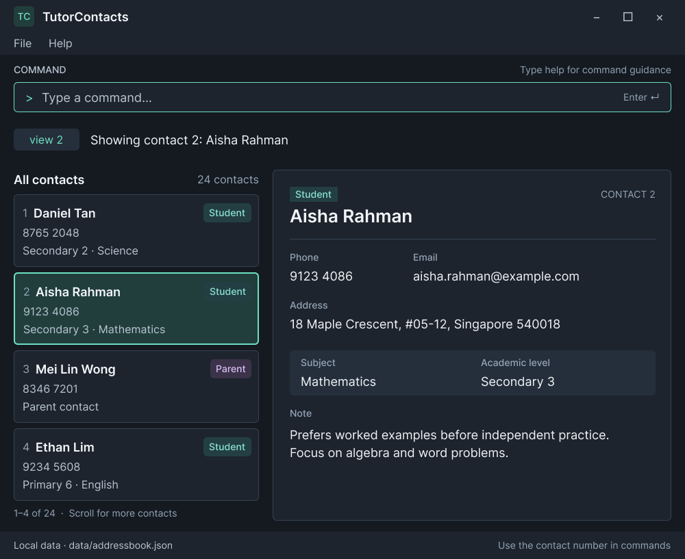

# TutorContacts

TutorContacts is a desktop contact manager for independent private tutors who manage many students and
parents. It keeps essential contact and tuition information in one place and is optimized for tutors who
prefer fast, typed commands.

The planned MVP focuses on a small, reliable set of contact-management tasks:

* add student and parent contacts with role-specific details;
* list all saved contacts;
* view the complete details of one contact;
* delete contacts; and
* save contact data locally between sessions.

## Project links

* [Product website](https://ay2627s1-cs2103t-t17-1.github.io/tp/)
* [User Guide](https://ay2627s1-cs2103t-t17-1.github.io/tp/UserGuide.html)
* [Developer Guide](https://ay2627s1-cs2103t-t17-1.github.io/tp/DeveloperGuide.html)
* [About Us](https://ay2627s1-cs2103t-t17-1.github.io/tp/AboutUs.html)

## Acknowledgements

TutorContacts is based on the [AddressBook-Level3](https://se-education.org/addressbook-level3/) project
created by the [SE-EDU initiative](https://se-education.org/).

The project uses [JavaFX](https://openjfx.io/), [Jackson](https://github.com/FasterXML/jackson), and
[JUnit 5](https://github.com/junit-team/junit5).
