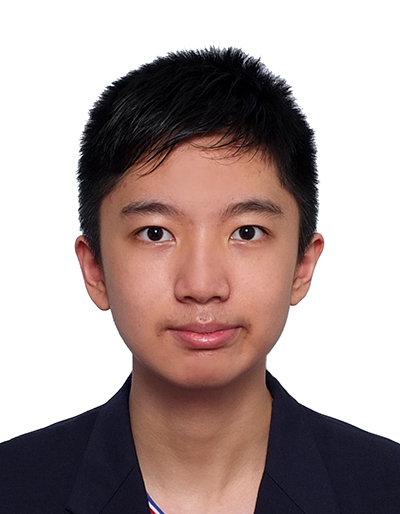

We are a team based in the [School of Computing, National University of Singapore](https://www.comp.nus.edu.sg).

## Project team

### Lim Qi Zao

[[github](https://github.com/zao05)]

* Role: In charge of Logic, Testing
* Responsibilities: Knows the Logic component best and reviews changes to it; ensures the project's testing is done properly and on time.

### Jingyu Shi

[[github](https://github.com/jingyucodes)]

* Role: Documentation, Scheduling and tracking
* Responsibilities: Ensures the quality, format, and consistency of project documents; defines, assigns, and tracks project tasks and milestones.

### Khor Kai Shean

[[github](https://github.com/kks070206)]

* Role: Deliverables and deadlines
* Responsibilities: Ensures project deliverables are done on time and in the right format.

### Joel Rhys

[[github](https://github.com/Antelyuu)]

* Role: Team lead, In charge of Model and Storage, Integration
* Responsibilities: Coordinates the overall project; knows the Model and Storage components best and reviews changes to them; maintains the code repository and integrates the team's work.

### Toh Qi Zhang

[[github](https://github.com/qztoh)]

* Role: In charge of UI, Code quality
* Responsibilities: Knows the UI component best and reviews changes to it; looks after code quality and adherence to coding standards.
